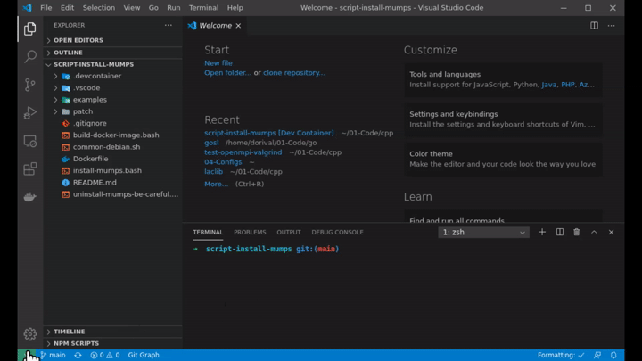

# Script to install METIS and MUMPS

The script `install-mumps.bash` builds both static and **dynamic** libraries for the MUMPS sparse solver. We offer options to use the Intel compilers and to use OpenMP.

We consider two sets of tools:

1. `_open`: GCC GFortran + OpenBLAS + OpenMPI; and
2. `_intel`: Intel compilers + Intel MKL + Intel MPI

The resulting libraries will have the suffix `_open` or `_intel` corresponding to the cases 1 or 2 above. If the option **OMP** (OpenMP) is selected, the libraries will have the suffix `_open_omp` and `_intel_omp`.

**NOTE:** All libraries can co-exist with each other and the default Debian libraries in your system.

The script `install-mumps.bash` downloads MUMPS' source code from the Debian repository, compiles the code and installs the headers to `/usr/local/include/mumps` and the libraries (static and dynamic) to `/usr/local/lib/mumps`.

For the `_intel` case, we also download and compile {Par}METIS because we cannot use Debian's _libparmetis_ with Intel MPI. The include files will go to `/usr/local/include/metis` and the library files will go to `/usr/local/lib/metis`. The METIS libraries will have a suffix `_intel` and can co-exist with Debian's libraries. The `_open` version will also use PT-SCOTCH.

You may build a Docker image or run the script directly in an Ubuntu/Linux system. The Docker image will have a size of approximately 1GB; however, the `_intel` Docker image will be 8GB!

The docker image is convenient with Visual Code remote development tools (but containerized; "not really remote").

## Docker Image

We can build the Docker image by running:

```bash
./build-docker-image-open.bash
# or
source /opt/intel/oneapi/setvars.sh
./build-docker-image-intel.bash
```

**NOTE:** If you compile the code using the Intel tools (after `source setvars.sh`) and decide to compile the `_open` version, you'll have to open another terminal (because of setvars.sh).

Open the terminal in a temporary Docker container:

```bash
docker run --rm -it mumps_open /bin/bash
# or
docker run --rm -it mumps_intel /bin/bash
```

Alternatively, use [Visual Code Remote Development](https://code.visualstudio.com/docs/remote/remote-overview). First, create a directory and copy the `.devcontainer` directory into it.

Then, open your project folder (e.g. this repo folder) in Visual Studio Code and click the green button at the window's left-bottom corner. Choose _Reopen in Container_.


If you want to debug using the VS Code editor, copy the `.vscode` directory to your project and modify as appropriate. See the example below of how convenient it is to use VS Code for debugging the code.



## Ubuntu/Linux 20.10

You may use the `install-mumps.bash` script directly, observing the input arguments or the convenience `all-{open,intel}.bash` scripts. Note that the installation script will also create a file to configure
/etc/ld.so.conf.d/mumps.conf.

### Install dependencies

Run:

```bash
./install-deps-open.bash
# or
./install-deps-intel.bash
```

### Compile and install MUMPS on Ubuntu

```bash
./all-open.bash
# or
source /opt/intel/oneapi/setvars.sh
./all-intel.bash
```

For example, the following libraries are installed:

```
/usr/local/lib/mumps
├── libdmumps_open.a
├── libdmumps_open_omp.a
├── libdmumps_open_omp.so
├── libdmumps_open.so
├── libmumps_common_open.a
├── libmumps_common_open_omp.a
├── libmumps_common_open_omp.so
├── libmumps_common_open.so
├── libpord_open.a
├── libpord_open_omp.a
├── libpord_open_omp.so
└── libpord_open.so
```

### Remove include and library files on Ubuntu:

Use the following scripts:

1. `uninstall-metis.bash`
2. `uninstall-mumps.bash`
